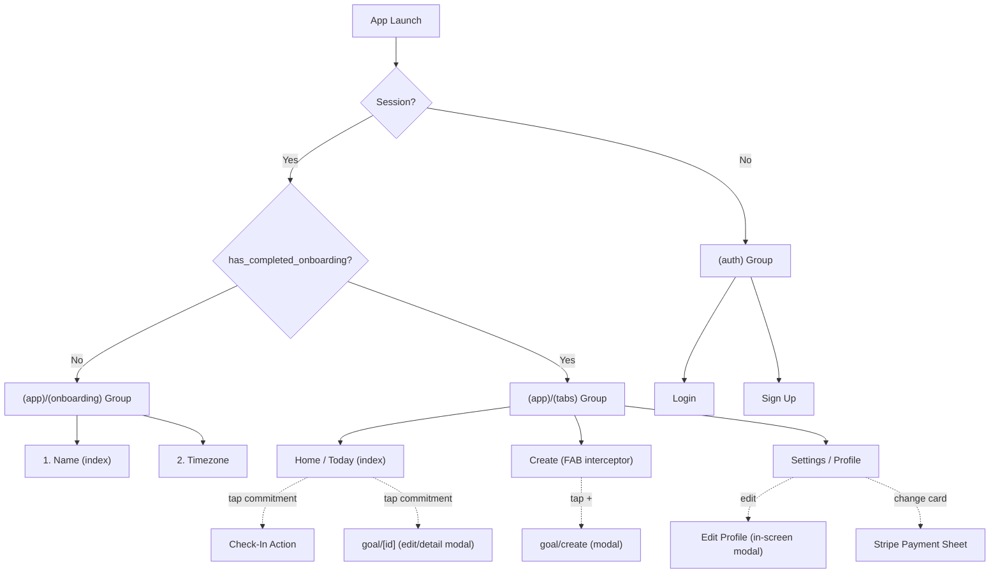

# stalld — App Structure (MVP)

> Expo Router file-based routing. The `(app)` group gates authenticated screens;
> onboarding and the main tabs live inside it.

---

## Navigation Flow



> [!NOTE]
> Adding a payment method is **not** an onboarding step. It happens in Settings,
> and creating a commitment is gated on `profiles.has_payment_method` (the create
> FAB and `goal/create` block until a card is on file).

---

## File Structure

```
app/
├── _layout.tsx                    # Root: fonts, StripeProvider, AuthProvider, session gating, NotificationProvider
│
├── (auth)/                        # 🔓 Unauthenticated screens
│   ├── _layout.tsx                # Stack layout, no header
│   ├── login.tsx                  # Email + password login
│   └── signup.tsx                 # Email + password sign up
│
└── (app)/                         # 🔒 Authenticated screens
    ├── _layout.tsx                # Onboarding gating + registers tabs, onboarding, goal modals
    ├── index.tsx                  # Redirect → (app)/(tabs)
    │
    ├── (onboarding)/              # 🆕 Post-signup setup (uses OnboardingProvider)
    │   ├── _layout.tsx            # Onboarding stack layout
    │   ├── index.tsx              # Step 1: First + last name
    │   └── timezone.tsx           # Step 2: Timezone → completes onboarding
    │
    ├── (tabs)/                    # 🏠 Main app (authenticated + onboarded)
    │   ├── _layout.tsx            # Bottom tab navigator + center FAB interceptor
    │   ├── index.tsx              # HOME — Today's check-ins + all commitments
    │   ├── create.tsx             # Spacer tab (FAB interceptor; never renders a screen)
    │   └── settings.tsx           # SETTINGS — Profile, payment method, sign out
    │
    └── goal/                      # 📋 Commitment screens (presented as modals)
        ├── create.tsx             # Create a commitment (Routine/Task flow)
        └── [id].tsx               # Commitment detail (edit, pause/resume)
```

---

## Screen Breakdown

### (auth) — Unauthenticated

| Screen   | Purpose                  | Key Actions                                           |
| -------- | ------------------------ | ----------------------------------------------------- |
| `login`  | Returning users sign in  | Email/password → Supabase Auth                        |
| `signup` | New users create account | Email/password → creates auth user → triggers profile |

### (app)/(onboarding) — First-Time Setup

Sequential flow wrapped by `OnboardingProvider`. User must complete it before
reaching the tabs.

| Screen     | Purpose                   | DB Action                                       |
| ---------- | ------------------------- | ----------------------------------------------- |
| `index`    | Collect first & last name | (held in onboarding state)                      |
| `timezone` | Set timezone & finish     | `UPDATE profiles SET timezone, has_completed_onboarding = true` |

> [!IMPORTANT]
> **How to detect "onboarded":** Check `profiles.has_completed_onboarding`.
> `(app)/_layout.tsx` redirects users with `has_completed_onboarding === false`
> into the onboarding group, and redirects completed users out of it.

### (app)/(tabs) — Main App

| Tab             | Screen     | Purpose                                                                                          |
| --------------- | ---------- | ------------------------------------------------------------------------------------------------ |
| 🏠 **Home**     | `index`    | Today's commitments needing check-in (tap to complete) plus all commitments grouped by day.      |
| ➕ **Create**   | `create`   | Not a real screen — a spacer that intercepts the center FAB. Blocks if no payment method on file. |
| ⚙️ **Settings** | `settings` | Profile info, single payment method (change card), sign out.                                     |

### Standalone Screens (modals)

| Screen        | Purpose             | Notes                                                          |
| ------------- | ------------------- | -------------------------------------------------------------- |
| `goal/create` | Create a commitment | Routine vs Task, schedule, stakes ($), deadline timing. Gated on `has_payment_method`. |
| `goal/[id]`   | Commitment detail   | Edit details, pause/resume.                                    |

> Profile editing and changing the payment method are handled **within**
> `settings.tsx` (an in-screen modal + the Stripe Payment Sheet), not as separate
> routes. There is no standalone `profile/edit` or `charges` screen.

---

## Key Providers / Context

| Provider              | Mounted in            | Purpose                                                                       |
| --------------------- | --------------------- | ----------------------------------------------------------------------------- |
| `AuthProvider`        | root `_layout.tsx`    | Supabase session + the user's `profile`; exposes `signIn`, `signUp`, `signOut`, `refreshProfile`. |
| `NotificationProvider`| root `_layout.tsx`    | Push/local notification setup and handling.                                   |
| `OnboardingProvider`  | onboarding layout     | Holds in-progress onboarding form state across the steps.                     |
| `StripeProvider`      | root `_layout.tsx`    | Stripe React Native context for the Payment Sheet.                            |

> There is no separate `ProfileProvider`; the profile lives in `AuthProvider`.

---

## Routing Logic

**Root `_layout.tsx` → `RootNavigator` (session gating):**

```
1. App loads → AuthProvider resolves the Supabase session
2. No session + not in (auth) → redirect to /(auth)/login
3. Has session + in (auth) → redirect to /(app)
```

**`(app)/_layout.tsx` (onboarding gating):**

```
4. profile.has_completed_onboarding === false → redirect to /(app)/(onboarding)
5. has_completed_onboarding === true but on an onboarding route → redirect to /(app)/(tabs)
6. /(app)/index.tsx redirects to /(app)/(tabs)
```
