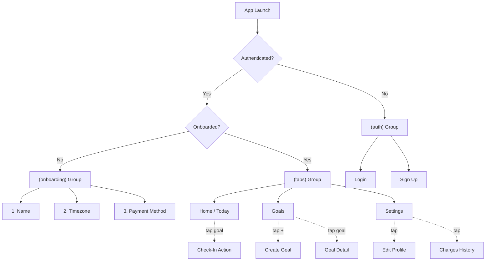

# Momentum — App Structure (MVP)

> Expo Router file-based routing with route groups for auth gating.

---

## Navigation Flow



---

## File Structure

```
app/
├── _layout.tsx                    # Root layout: loads fonts, auth provider, splash
├── index.tsx                      # Entry redirect (→ auth or tabs based on session)
│
├── (auth)/                        # 🔓 Unauthenticated screens
│   ├── _layout.tsx                # Stack layout, no header
│   ├── login.tsx                  # Email + password login
│   └── signup.tsx                 # Email + password sign up
│
├── (onboarding)/                  # 🆕 Post-signup, pre-app setup
│   ├── _layout.tsx                # Stack layout, no back button
│   ├── name.tsx                   # First name + Last name
│   ├── timezone.tsx               # Timezone picker
│   └── payment.tsx                # Add credit card (Stripe)
│
├── (tabs)/                        # 🏠 Main app (authenticated + onboarded)
│   ├── _layout.tsx                # Bottom tab navigator
│   ├── index.tsx                  # HOME — Today's check-ins
│   ├── goals.tsx                  # GOALS — All goals list
│   └── settings.tsx               # SETTINGS — Profile & account
│
├── goal/                          # 📋 Goal-related modals/screens
│   ├── create.tsx                 # Create a new goal
│   └── [id].tsx                   # Goal detail (edit, pause, view history)
│
├── profile/
│   └── edit.tsx                   # Edit name, timezone, payment method
│
└── charges.tsx                    # Charges/penalty history (read-only)
```

---

## Screen Breakdown

### (auth) — Unauthenticated

| Screen | Purpose | Key Actions |
|---|---|---|
| `login` | Returning users sign in | Email/password → Supabase Auth |
| `signup` | New users create account | Email/password → creates auth user → triggers profile |

### (onboarding) — First-Time Setup

Sequential, non-skippable flow. User must complete all steps before accessing the app.

| Screen | Purpose | DB Action |
|---|---|---|
| `name` | Collect first & last name | `UPDATE profiles SET first_name, last_name` |
| `timezone` | Set their timezone | `UPDATE profiles SET timezone` |
| `payment` | Add credit card via Stripe | Stripe SDK → save `stripe_customer_id` to profile |

> [!IMPORTANT]
> **How to detect "onboarded":** Check if `profiles.first_name` is `null`. If it is, the user hasn't completed onboarding. This works because the auto-create trigger leaves `first_name` as `null`.

### (tabs) — Main App

| Tab | Screen | Purpose |
|---|---|---|
| 🏠 **Home** | `index` | Shows today's goals that need check-in. Tap to mark complete. Shows checked-in vs remaining. |
| 🎯 **Goals** | `goals` | Full list of all goals (active, paused). FAB button to create new. Tap to view detail. |
| ⚙️ **Settings** | `settings` | Profile info, payment method, charges history link, sign out. |

### Standalone Screens

| Screen | Purpose | Notes |
|---|---|---|
| `goal/create` | Create a new goal | Title, amount ($), day picker (Mon–Sun toggles) |
| `goal/[id]` | Goal detail | View check-in history, edit, pause/resume, cancel |
| `profile/edit` | Edit profile | Change name, timezone, payment method |
| `charges` | Charges history | Read-only list of past penalties with status |

---

## Key Providers / Context

These wrap the app in `_layout.tsx`:

| Provider | Purpose |
|---|---|
| `AuthProvider` | Manages Supabase session state, exposes `user`, `signIn`, `signOut` |
| `ProfileProvider` | Fetches & caches the user's profile, exposes `profile`, `isOnboarded` |

---

## Routing Logic (Root `_layout.tsx`)

```
1. App loads → check Supabase session
2. No session → show (auth) group
3. Has session → fetch profile
4. Profile.first_name is null → show (onboarding) group
5. Profile is complete → show (tabs) group
```

> [!NOTE]
> The root `index.tsx` acts as a redirect based on this logic. It doesn't render its own UI — it just pushes to the correct group.
